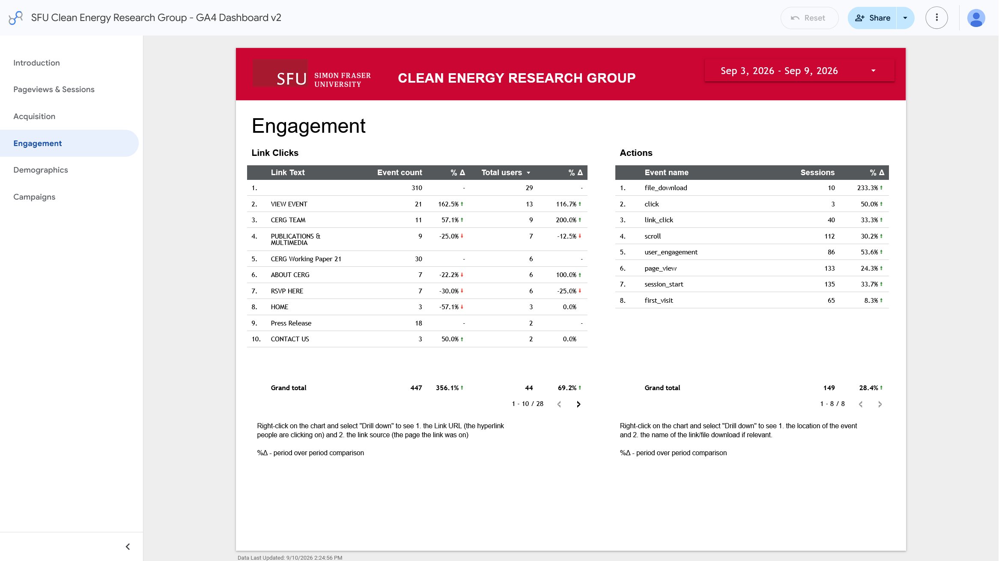
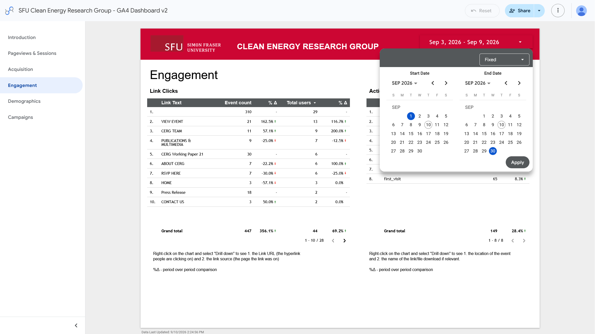
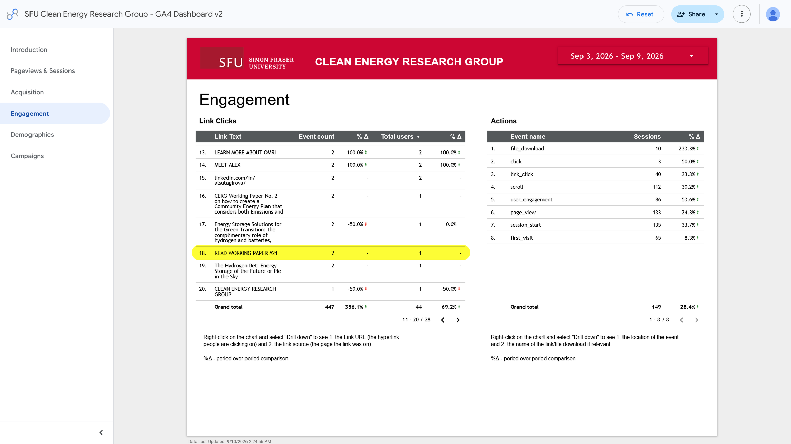

# View downloads of Working Papers

!!! warning "Downloads aren't only the way to view Working Papers"

    This metric is only tracking the links that people click to download the Working Papers. If someone views the Working Paper's PDF embed on the page without clicking the download link, that won't be counted in this metric. If you want to track how many people are viewing the Working Papers pages, visit [How to see page views](how-to-see-page-views.md).

## Visit CERG's Google Analytics page
Ensure you are logged in to your SFU Google account and have gotten access by IT Services. If you don't have access, [request analytics access here](https://sfu.teamdynamix.com/TDClient/255/ITServices/Requests/TicketRequests/NewForm?ID=k6L7JFs9s8o_&RequestorType=ServiceOffering).

[Go to Google Analytics Engagement page :material-arrow-top-right-thick:](https://datastudio.google.com/u/7/reporting/78ed74d3-7641-46f1-96dd-ac15a22faf66/page/p_6n8soyom4c ){ .md-button .md-button--primary target="_blank"}

If you aren't already on the "Engagement" page, click the "Engagement" tab in the left sidebar.

/// caption
Google Analytics Engagement page
///

!!! info "Link Clicks vs Actions"
    On the Engagement page, you'll see two charts: Link Clicks and Actions. We will focus on Link Clicks chart, as that gives us a more reliable view of engagement.

## Choose a date range
Click the date range in the top right corner of the page to select a date range for which you want to see page views. You can select a custom date range or choose from the preset options.

/// caption
Google Analytics date range selection
///

!!! info "Tracking Views Over Time"

    When tracking page views over time, it's important to keep the same date range consistent for accurate comparisons. I'd recommend tracking by month as it is simple to visualize and provides a good balance between capturing enough data and avoiding short-term fluctuations.

## Find metrics for a specific working paper
If you want to know how many people clicked the download link for a specific Working Paper, you can find that information in the Link Clicks chart.

Since there is no search bar, you'll need to find the Working Paper link in the chart. If it was recently published and has lots of traction, it should be on the first page. Otherwise, you can use the arrows at the bottom of the chart to navigate through the pages until you find the link.

The link name should look like this: `Read Working Paper #21`

/// caption
Google Analytics Working Paper link highlighted
///

## Creating visualizations for downloads over time

!!! bug "Not working"

    ### With Google Data Studio
    Right click on any data point or table and select the "Explore" feature. From there, you can create a number of visualizations.

    Currently, clicking "Explore from Here" currently ends in a configuration error:

    | Explore   | Data Configuration Error                          | 
    |:---------|:-------------------------------------|
    |   |   |

    If the "Explore" feature is fixed in the future, Max will update this page with instructions on how to use it to create visualizations of downloads over time.
