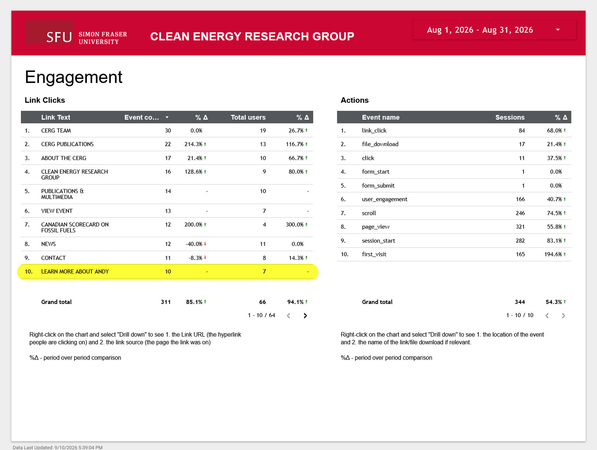

# View links clicked

## Visit CERG's Google Analytics Engagement page
Ensure you are logged in to your SFU Google account and have gotten access by IT Services. If you don't have access, [request analytics access here](https://sfu.teamdynamix.com/TDClient/255/ITServices/Requests/TicketRequests/NewForm?ID=k6L7JFs9s8o_&RequestorType=ServiceOffering).

[Go to Google Analytics Engagement page :material-arrow-top-right-thick:](https://datastudio.google.com/u/7/reporting/78ed74d3-7641-46f1-96dd-ac15a22faf66/page/p_6n8soyom4c ){ .md-button .md-button--primary target="_blank"}

If you aren't already on the "Engagement" page, click the "Engagement" tab in the left sidebar.

/// caption
Google Analytics Engagement page
///

!!! info "Link Clicks vs Actions"
    On the Engagement page, you'll see two charts: Link Clicks and Actions. We will focus on Link Clicks chart, as that gives us a more reliable view of engagement.

## Choose a date range
Click the date range in the top right corner of the page to select a date range for which you want to see page views. You can select a custom date range or choose from the preset options.

/// caption
Google Analytics date range selection
///

!!! info "Tracking Views Over Time"

    When tracking page views over time, it's important to keep the same date range consistent for accurate comparisons. I'd recommend tracking by month as it is simple to visualize and provides a good balance between capturing enough data and avoiding short-term fluctuations.

## Find metrics for a specific button
If you want to know how many people clicked a specific button on the CERG website, you can find that information in the Link Clicks chart.

Since there is no search bar, you'll need to find the button text manually in the chart.

The link text should match the button text on the CERG website. For example, if you want to see how many people clicked the "Learn more about Andy" button, look for that text in the chart.

/// caption
Google Analytics number of button clicks
///

## Find metrics for a specific URL
If you want to know how many people and where they came from to get to a specific page or URL on the CERG website, you can find that information in the Link Clicks chart.

Since there is no search bar, you'll need to find the button text manually in the chart:

1. Right click on the chart and select "Drill Down".
1. Find the URL that you want to track. This will give you a general sense of clicked on a button to get to that URL.
1. Left click on it to make it bold, then right click on it and select "Drill Down". This will show which pages people came from to get to that URL.
1. To reset, click the reset icon in the top left corner of the chart.

<video controls width="100%">
  <source src="../video/viewing metrics for url.mp4" type="video/mp4">
  Your browser does not support the video tag.
</video>
/// caption
Example of finding metrics for a working paper URL
///

!!! info "Link Source: `{not set}`"
    When drilling down to find metrics for a specific URL, you may see some links with the source listed as `{not set}`. This means that the link was clicked from an external source, such as a social media post or an email.

    If you want to track a specific source of traffic, visit [Analyze page views](how-to-see-page-views.md#find-metrics-from-a-specific-source).

