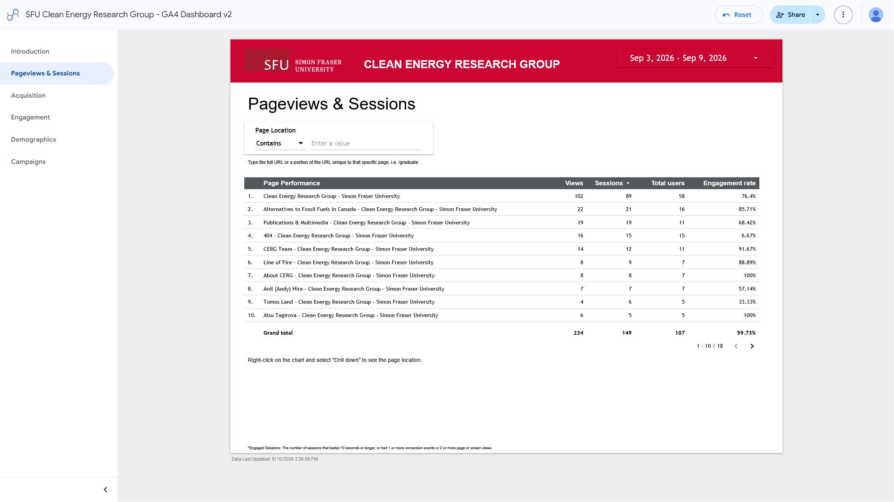
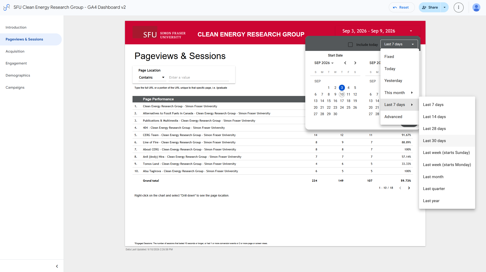
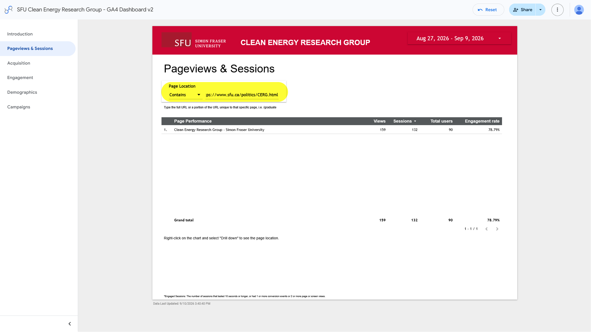
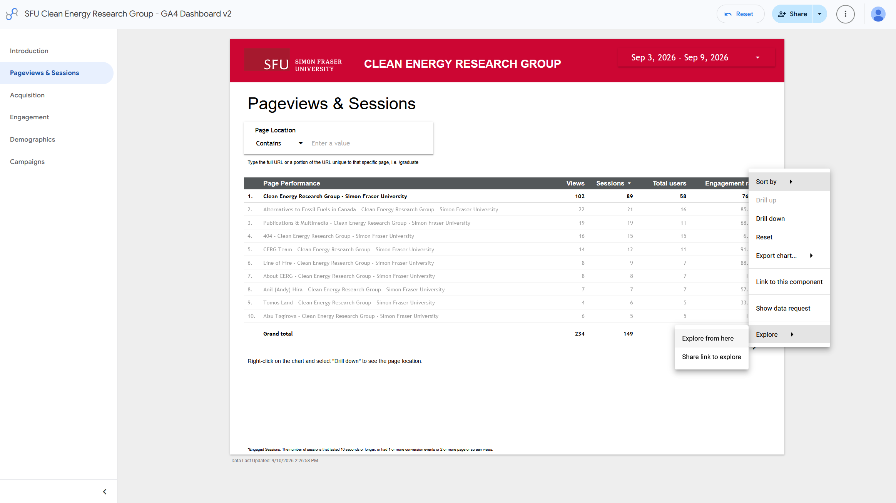
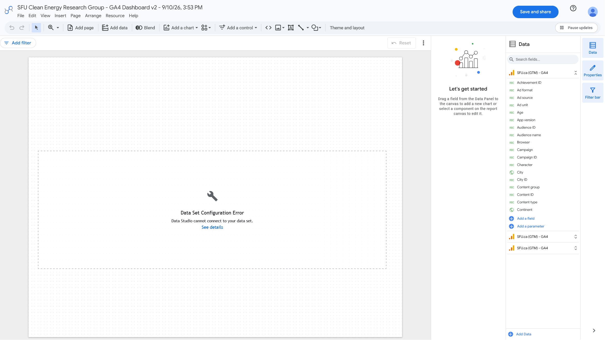
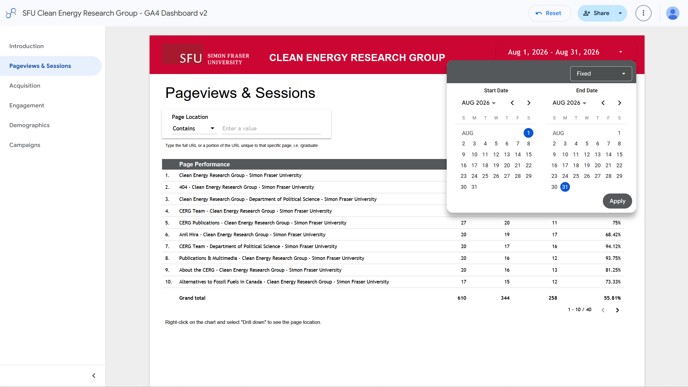
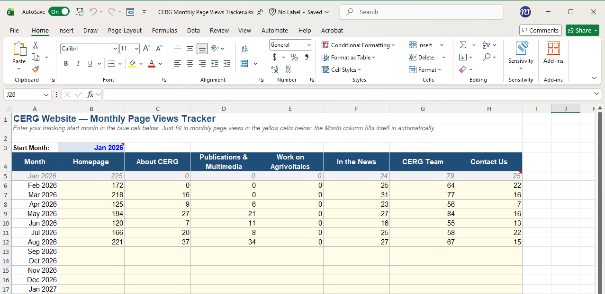

# How to see page views
How to see page views of CERG website pages using Google Analytics.

## Visit CERG's Google Analytics page
Ensure you are logged in to your SFU Google account and have gotten access by IT Services. If you don't have access, [request analytics access here](https://sfu.teamdynamix.com/TDClient/255/ITServices/Requests/TicketRequests/NewForm?ID=k6L7JFs9s8o_&RequestorType=ServiceOffering).

[Go to Google Analytics :material-arrow-top-right-thick:](https://datastudio.google.com/u/7/reporting/78ed74d3-7641-46f1-96dd-ac15a22faf66/page/Xqh8B ){ .md-button .md-button--primary target="_blank"}

/// caption
Google Analytics Pageviews & Sessions page
///

## Choose a date range
Click the date range in the top right corner of the page to select a date range for which you want to see page views. You can select a custom date range or choose from the preset options.

!!! info "Tracking Views Over Time"

    When tracking page views over time, it's important to keep the same date range consistent for accurate comparisons. I'd recommend tracking by month as it is simple to visualize and provides a good balance between capturing enough data and avoiding short-term fluctuations.

/// caption
Google Analytics date range selection
///

## Find metrics for a specific page
Use the search bar at the top of the page to search for a specific page by its URL. 

1. Copy the page URL from the CERG website
1. Paste the URL into the search bar in Google Analytics and press enter.
1. The search results will show you the page views and sessions for that specific page.

/// caption
Google Analytics page view results
///

## Creating visualizations for page views over time

!!! bug "Not working"

    ### With Google Data Studio
    Right click on any data point or table and select the "Explore" feature. From there, you can create a number of visualizations.

    Currently, clicking "Explore from Here" currently ends in a configuration error:

    | Explore   | Data Configuration Error                          | 
    |:---------|:-------------------------------------|
    |   |   |

    If the "Explore" feature is fixed in the future, Max will update this page with instructions on how to use it to create visualizations of page views over time.

### With Excel
Currently, there's no way to export time-series data directly from Google Analytics. Your best bet is to record the data manually using a spreadsheet and create the visualizations in Excel:

**Use this excel spreadsheet to record page views:**

[Go to Excel Spreadsheet :material-arrow-top-right-thick:](https://1sfu-my.sharepoint.com/:x:/r/personal/ahira_sfu_ca/Documents/clean%20energy/website/Website%20Renovation/Analytics/CERG%20Monthly%20Page%20Views%20Tracker.xlsx?d=wd681e55bbbbb4ac89da2b503b5cb67e6&csf=1&web=1&e=sTg55n){ .md-button .md-button--primary target="_blank" .md-button--block }

In Google Data Studio select the date range for the month you want to track page views for and record the page views for each page in the spreadsheet:

| Set date range   | Input in Excel                          | 
    |:---------|:-------------------------------------|
    |   |   |

#### View graph of page views over time
1. In the "Data" sheet, go to the "View" tab
1. Click on the Sheet View dropdown menu in the top left corner and select "Chart View"
1. The line charts will now only show the months with data in them
1. To add more data to each month, reselect the "Default" sheet view

{ .skip-lightbox }
/// caption
Viewing graph of page views over time in Excel
///