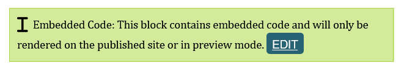

# YouTube video feeds

There are many YouTube feeds on the CERG website. Some feeds automatically pull in videos from a YouTube playlist, while others are manually curated to show specific videos.

The feed is always inside a green HTML/embedded code component:



## Feed properties
Every feed is controlled by a small set of settings. You won't need all of them at once. Which ones you fill in depends on what you want the feed to show:

Setting | What it does | How to use it
--------|--------------|--------------
Videos <br> `data-videos` | Shows specific videos that you choose. | Paste in one or more YouTube links separated by commas.
Playlist <br> `data-playlist` | Automatically shows the newest videos from a YouTube playlist. However the playlist is sorted on YouTube, it shows the videos in that order. | Paste in the playlist link. Only one is supported.
Max videos <br> `data-max-videos` | How many videos to show. Only matters when you're using Playlist. With Videos, the feed just shows however many you listed. | Enter in a number; default is 2.
Title style <br> `data-title-style` | Controls how each video's title looks. | Default is `regular` (bold text). Set to `heading` if the feed is more prominent on the page.

!!! note "Videos > Playlist"
    If you fill in both Videos and Playlist, the feed will show the hand-picked videos you listed in Videos. The Playlist setting will be ignored.

!!! note "Displays nothing if no videos or playlist are set"
    This is expected. It ensures the feed can be used safely in templates without configuration when no videos or playlists are needed.


## How to set up a new feed
1. Add an HTML component into a column control component wherever the feed should sit. Ensure it takes up less than 50% of the page width, otherwise the feed will look big. 
1. Click edit. It will open a coding text box in a new tab.
2. Paste in the following code:
   ```html
   <script src="https://www.sfu.ca/content/dam/sfu/politics/CERG/code/js/iframe.js"></script>
    <iframe class="sfu-video-embed"
        src="https://cerg-youtube-feed.pages.dev/latest-videos-styled"
        
        data-videos=""
        data-playlist=""
        data-max-videos="2"
        data-title-style="regular"
        
        title="CERG Youtube Feed" width="100%" height="800px" frameborder="no"
        allow="accelerometer; autoplay; clipboard-write; encrypted-media; gyroscope; picture-in-picture; web-share"
        style="border-style: none; overflow: hidden; transition: height 0.2s ease;">
    </iframe>
   ```

3. Fill in **one** of the settings — either `data-videos` or `data-playlist`, following the details for the [feed properties](#feed-properties) for whichever you're using.
4. Press the save button in the top left and close the coding window.
1. To see the feed before publishing, switch to preview mode and reload the page. The feed should show up in the column you added it to.
1. [Activate the page](../general/update-info-on-a-page.md#while-editing-inside-a-page).


## How to change an existing feed

### To show a YouTube playlist
1. Copy the playlist link from YouTube. It should look like this: `https://www.youtube.com/playlist?list=PLHSY2zpB60yE`
1. Click the `Edit` button on the HTML component.
1. Make sure `data-videos` is empty. It should be left as an empty string: `data-videos=""`.
1. Paste the playlist link into the `data-playlist` setting. 
1. If you want to show a specific number of videos, change the `data-max-videos` setting.
1. Press the save button in the top left and close the coding window.
1. To see the feed before publishing, switch to preview mode and reload the page. 
1. [Activate the page](../general/update-info-on-a-page.md#while-editing-inside-a-page).


### To show specific videos
1. Find your video links from YouTube. They should look like this: `https://www.youtube.com/watch?v=video_id`
1. Click the `Edit` button on the HTML component.
1. Make sure `data-playlist` is empty. It should be left as an empty string: `data-playlist=""`.
1. Paste the video links into the `data-videos` setting, separated by commas.
1. If you want to show a specific number of videos, change the `data-max-videos` setting.
1. Press the save button in the top left and close the coding window.
1. To see the feed before publishing, switch to preview mode and reload the page. 
1. [Activate the page](../general/update-info-on-a-page.md#while-editing-inside-a-page).


### To show the homepage
1. Fill in `data-playlist=""` with the channel's uploads playlist ID: 
    ```
    UURAuV8XqQM0MD3VK_Pi32AA
    ```

2. Make sure `data-videos` is empty. It should be left as an empty string: `data-videos=""`.
1. To see the feed before publishing, switch to preview mode and reload the page. 
3. [Activate the page](../general/update-info-on-a-page.md#while-editing-inside-a-page).
