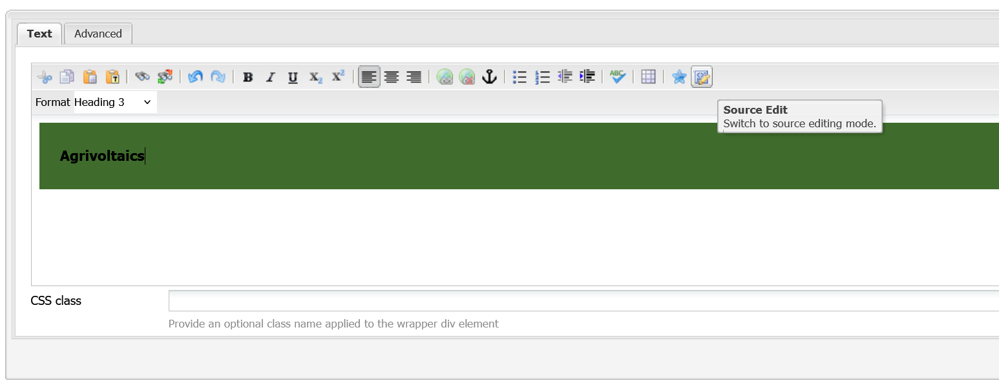
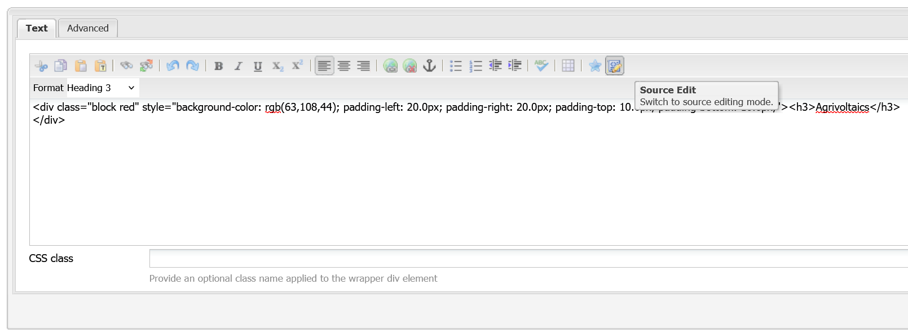

# Copy an existing component/design

## Copy and Paste within the same page
1. Right click on an existing component and select `Copy`.
1. Right click on an existing component or in the `Drag components and assets here` section and select `Paste`. It will paste the component above the one you right clicked on.
1. Change the information in the new card by right clicking on it and selecting `Edit`. Make sure to update all necessary information.
1. Press the `OK` button and [Activate the page](../general/update-info-on-a-page.md#while-editing-inside-a-page) to save your changes.

<video controls width="100%">
  <source src="../video/adding a team member agrivoltaics.mp4" type="video/mp4">
  Your browser does not support the video tag.
</video>
/// caption
Example of adding a second team member preview card on the Agrivoltaics page
///

## Copy and Paste to different pages
Unfortunately, there is no way to copy and paste components between different pages in AEM. If you want to copy a component from one page to another, you will need to manually create the component on the new page and manually copy over the design and content.

Things to copy:
1. Any text and image content.
1. CSS classes and styles for the component and its column control (if applicable).
1. Any other settings for the component (e.g. number of columns, pagination, captions, etc.).

!!! note "Custom Components & Source Edit"
    If you're having troubles copying a specific design, select the source edit button (the far right button in the text editor) and copy the raw HTML code over to the new component. Paste it in the new component's source edit mode as well. This will ensure the design is copied over exactly.

    
    /// caption
    Source edit button in the text editor
    ///

    
    /// caption
    Source edit enabled in the text editor
    ///
