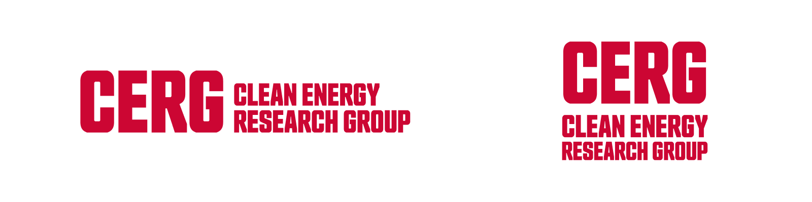

# Design

We follow [SFU's Web Communicators Toolkit](https://www.sfu.ca/communicators-toolkit/web.html) for the CERG website. The following is a summary of the most important design guidelines for the CERG website.

## CERG Colours
We follow SFU's [brand colours](https://www.sfu.ca/communicators-toolkit/brand/guidelines/colours.html) for the CERG website.

However, we have a few additional colours that are used for the Working Paper topics. These colours are used in the [Publications & Multimedia page :material-arrow-top-right:](https://www.sfu.ca/politics/CERG/works.html){ target="_blank"}, the [Agrivoltaics hub :material-arrow-top-right:](https://www.sfu.ca/politics/CERG/agrivoltaics.html){ target="_blank"}, and in [Working Paper Cover pages](../new-content/applying-a-working-paper-template.md).

### CERG Topic Colours
Topic | Colour | Hex | RGB
--- | --- | --- | ---
Agrivoltaics | Dark Green | `#3f6c2c` | `rgb(63, 108, 44)`
Alternative Energy Sources | Purple | `#5b3a8a` | `rgb(91, 58, 138)`
Community & Indigenous Energy | Brown | `#8a3a12` | `rgb(138, 58, 18)`
Energy Policy | Dark Blue | `#20374f` | `rgb(32, 55, 79)`
True Cost of Fossil Fuels | Dark Brown | `#43290f` | `rgb(67, 41, 15)`
Other Works | Gray | `#4a4a4a` | `rgb(74, 74, 74)`

## CERG Logos
We have a horizontal and square version of the CERG logo. The horizontal version is used in publications, while the square version is used for social media. 

View, download, and use the CERG logos in OneDrive:

[CERG Logos folder in OneDrive :material-arrow-top-right-thick:](https://1sfu-my.sharepoint.com/:f:/r/personal/ahira_sfu_ca/Documents/clean%20energy/website/Website%20Renovation/Logos?d=w57b54b8c0a6c4735b0f867f92f1390d4&csf=1&web=1&e=1bBJ7G){ .md-button .md-button--primary target="_blank"}

/// caption
CERG Logos
///

## CERG Working Paper Cover Templates
We have cover templates for Working Papers that can be applied in Microsoft Word. There are 4 templates variants available for each of the 6 topics. Go to the [Applying a Working Paper Template](../new-content/applying-a-working-paper-template.md) page to learn how to apply a template to your Working Paper.