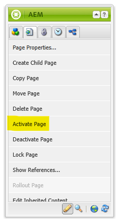
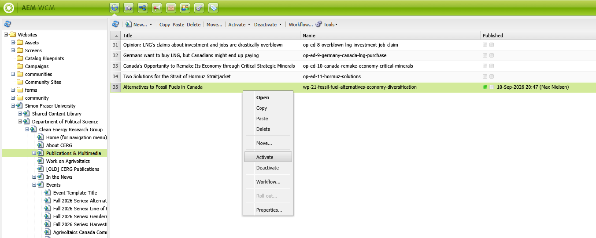
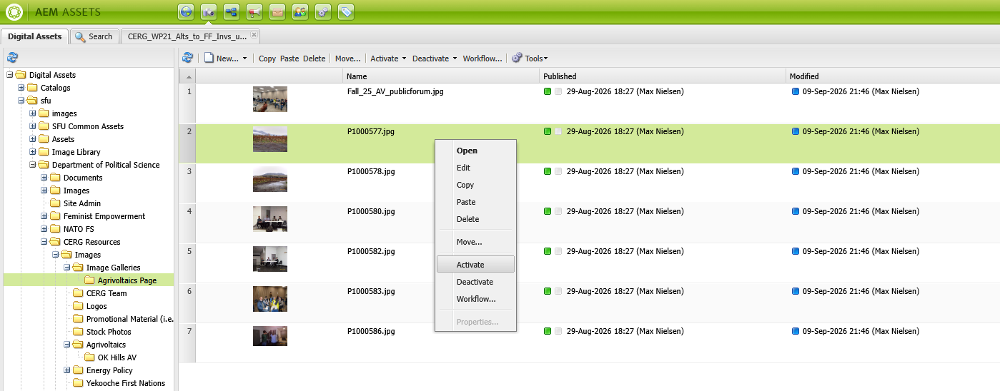

# Update info on a page

## Update text content
1. Right click on the text you want to edit and select `Edit`.
1. Make your changes in the text editor that appears. 
1. Use the formatting buttons a the top of the editor to format your text, add links, or (rarely) add images.
1. Press the `OK` button and [Activate the page](../general/update-info-on-a-page.md#while-editing-inside-a-page) to save your changes.

!!! warning "Text with `{{ }}`"
    Don't edit text inside curly brackets `{{ }}` — it's a variable placeholder auto-filled by the site, and editing it breaks the component. 

    If that text needs to change (e.g., event, working paper, or news article info), update it via [the documentation for that content type](../new-content/adding-a-working-paper.md) instead; changes will automatically reflect on your page.

!!! note "Custom Components & Source Edit"
    If you're having troubles editing specific content, it might have custom inline styles applied. In order to ensure the design is kept intact, select the source edit button (the far right button in the text editor) and find the text to edit. Keep the styles the same.

    
    /// caption
    Source edit button in the text editor
    ///

    
    /// caption
    Source edit enabled in the text editor
    ///

## Activating a page, image, document
Every time you make a change to a page, image, or document in AEM, you need to activate it for the changes to be reflected on the CERG website.

### Activate a page
#### While editing inside a page
When editing inside a page, you can click the Page icon in your tooibar, then select `Activate Page`.

#### While in WCM
When in WCM, you can right click on the page and select `Activate`.

### Activate an image or document
When uploading or pasting images or documents, you can right click on the image or document and select `Activate`.

## Updating an image
!!! info "Prerequisite"
    You have already uploaded the image to AEM that you want to use. If you haven't done this, follow the steps in [Uploading new photos and documents](../new-content/how-to-upload-new-photos-and-documents.md).

If you're replacing an image, make sure to keep the same aspect ratio as the original or within the recommended aspect ratios given to you in instructions for that content. Otherwise, the design will worsen and may not look good on certain screen sizes.

To edit an image, right click on the image and select `Edit`. You can then drag and drop a new image into the `Image` field from the sidebar. Press the `Crop` button to crop the image to the recommended aspect ratio.