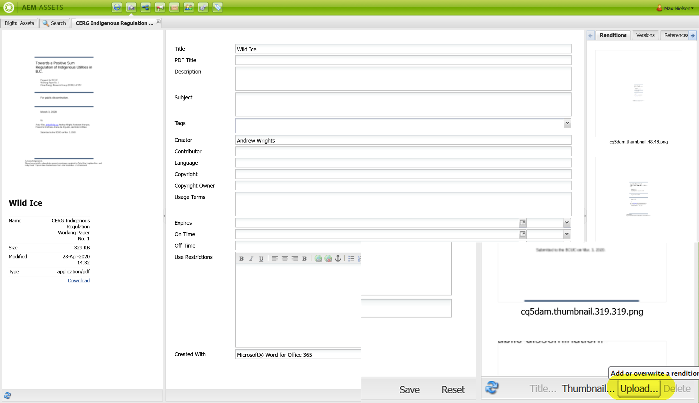
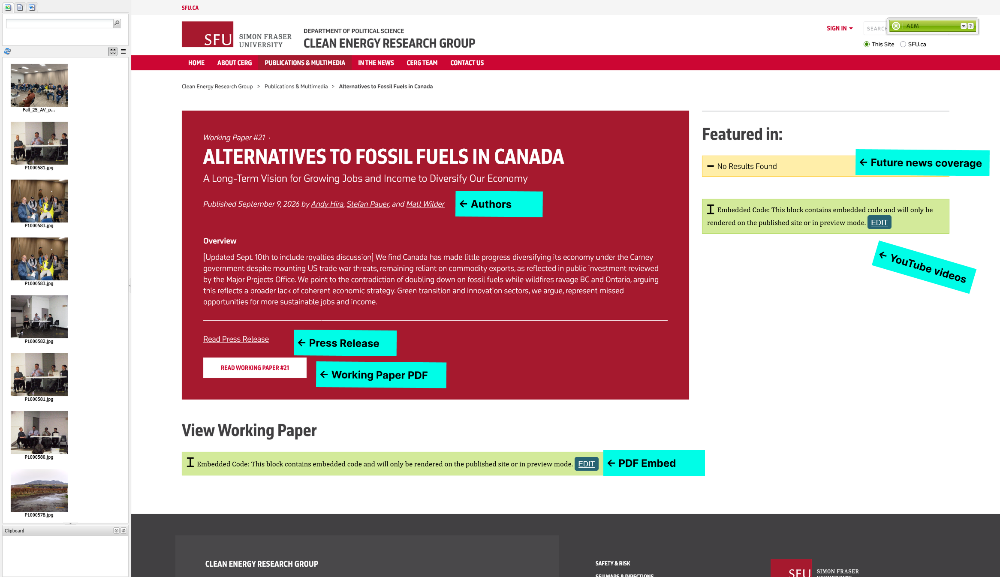

# Adding a Working Paper

## Upload the Working Paper PDF to AEM and Google Drive
??? info "Prerequisites"
    You must be signed into your SFU account and have access to AEM in order to make changes. If you do not have access, please [contact Andy](mailto:ahira@sfu.ca) to request access.

    You also must have access to the CERG Google Drive folder in order to upload the PDF. If you do not have access, please [contact Omri](mailto:omri_haiven@sfu.ca) to request access.

    You must have the PDF of the Working Paper ready to upload and the necessary content ready to fill in the page (title, overview, authors, etc.).

Upload the document to the Publications folder in AEM's DAM (Digital Asset Manager) and to the Working Papers folder in Google Drive:

[Publications Folder in DAM :material-arrow-top-right-thick:](https://author.sfu.ca/damadmin#/content/dam/sfu/politics/CERG/CERGResources){ .md-button .md-button--primary target="_blank"}
[Publications Folder in Google Drive :material-arrow-top-right-thick:](https://drive.google.com/drive/folders/1jB1ZHVwX63rywN0yH381QBlQ9sbWXOwW){ .md-button .md-button--primary target="_blank"}

After uploading in Google Drive, copy the link to the PDF by right clicking on the file and selecting `Share` -> `Copy link`. We will need that link later to [add the PDF Embed](#adding-pdf-embed).

??? tip collapse "Updating the working paper"
    If you need to update the Working Paper PDF, AEM has a feature to overwrite the existing file. That way, you can simply upload the new PDF and not have to worry about changing anything:
    
    
    
    Similar with Google Drive: upload the file with the exact same file name and it will overwrite the existing file. No need to change the link in the page.


## Copy Working Paper template
In AEM, navigate to the Publications & Multimedia page and copy the Working Paper template.

1. Go to the [Publications & Multimedia page :material-arrow-top-right:](https://author.sfu.ca/siteadmin#/content/sfu/politics/CERG/works){target="_blank"}
1. Right click on the `Working Paper Template (2026)` and select `Copy`.]
1. Click `Paste` to paste the template. Change the `Copy name` to this structure: `wp-xx-short-title` where `xx` is the number of the Working Paper and `short-title` is a 3-6 word keywords of the title (e.g., `wp-21-fossil-fuel-alternatives-economy-diversification`).
1. The new page will show up at the end of the list of pages. You may have to go to the next page to see it.

## Fill in Page Properties
Here we add the following information into the Page Properties of the new Working Paper page:

Content to be added | Type of content | Where it goes
--------------------|-----------------|----------------
Title | The first portion of the Working Paper title, before the colon (if applicable) | `Basic -> Title`
Tags | The keywords associated with the Working Paper | `Basic -> Tags/Keywords`
Date | The date the Working Paper was published (both short `09/13/2026` and long formats `September 13, 2026`) | `Basic -> Date` and `Advanced -> Custom Properties -> custom-publication-date`
Subtitle (if applicable) | The second portion of the Working Paper title, after the colon (if applicable) | `Basic -> More Titles and Description -> Subtitle`
Overview | A brief layman's summary of the Working Paper's content (max. 70 words) | `Basic -> More Titles and Description -> Description`
Working Paper Number | The number assigned to the Working Paper | `Advanced -> Custom Properties -> custom-publication-type`
Image (if applicable) | The cover image of the Working Paper as a `3:2 (Carousel)` aspect ratio | `Image`

1. Open up the page.
1. Select `Page Properties` from the `Page` menu.
1. Go through the three tabs in the Page Properties dialog and fill in the information above. If you don't have a cover image, you can leave the image field blank.

Filling in this information in Page Properties will automatically populate the Working Paper page with that information.

### Adding Tags
Tags are used to filter Working Papers by topic on the Publications & Multimedia page and Agrivoltaics page and to connect news items.

You must include the following tags for the Working Paper **in the following order** to appear in the correct places:

Type of tag | Why | Tag Name
--------------------|-----------------|----------------
Topic | To identify the topic of the Working Paper | See a [list of topics here](applying-a-working-paper-template.md#choose-a-template).
Publication Number | The number assigned to the Working Paper | X <br> where `X` is the number of the Working Paper (e.g. `21`)
Publication Medium | To identify it as a Working Paper; already on the template | Working Paper <br> `working_paper`


!!! warning "Topic tag must come first"
    Due to AEM restrictions, the topic tag must be the first tag in the list. If it is not, the Working Paper will not show the topic throughout the site.

<video controls width="100%">
  <source src="../video/adding a working paper.mp4" type="video/mp4">
  Your browser does not support the video tag.
</video>
/// caption
Video filling in Page Properties [coming soon]
///


## Editing the Working Paper page
While most content is added through Page Properties, some content is added directly to the page. This includes:

Content to be added | Type of content | Where it goes
--------------------|-----------------|----------------
Authors | The authors of the Working Paper | Red box component
Working Paper Download Button | The link to download the Working Paper | Red box component
Press Release (if applicable) | The link to download the Press Release | Red box component
PDF Embed | The PDF Google Drive link | Green HTML component below red box
Videos (if applicable) | Any videos related to the Working Paper | Green HTML component beside red box
News | Setting up to automatically display news about the Working Paper | List component that says "No Results Found"


/// caption
The location of each piece of content that needs to be changed
///


### Adding Authors and PDF Link
1. Right click on the red box component and select `Edit`.
1. Enter the names of the authors of the Working Paper, linking to their CERG profile or LinkedIn (if available).
1. Change the link of the Press Release button to the Press Release PDF. Delete if there's no Press Release.
1. Change the link of the Working Paper button to the Working Paper PDF.

<video controls width="100%">
  <source src="../video/adjusting author and pdf link.mp4" type="video/mp4">
  Your browser does not support the video tag.
</video>
/// caption
Video showing how to add authors and PDF links
///


### Adding PDF Embed
1. Ensure you've uploaded the PDF to Google Drive and copied the link to it.
1. Below the red box, click the green HTML component's `Edit` button.
1. In the HTML editor, paste the Google Drive link to the PDF that you copied earlier into the quotation marks `""` of the `src` attribute of the `<iframe>` tag.
1. Change the ending of the link from `/view?usp=drive_link` to `/preview`. This will allow the PDF to be embedded in the page instead of opening in a new tab.
1. Save the changes and close the HTML editor.

<video controls width="100%">
  <source src="../video/adding pdf embed.mp4" type="video/mp4">
  Your browser does not support the video tag.
</video>
/// caption
Video showing how to add PDF embed
///

### Adjust "Featured In" section

#### Adding related YouTube video (i.e. webinar recordings)
1. Beside the red box, click the green HTML component's `Edit` button.
1. In the HTML editor, add any videos related to the Working Paper. If there are no videos, delete the entire `<div>` element that contains the "Featured In" section.

Follow the instructions in [YouTube video feeds](../changing-content/yt-video-feeds.md#to-show-specific-videos) to add specific videos to the feed.

#### Configure related news list
!!! warning "Please follow instructions carefully"
    Please do not alter any other setting or text in the List component. It might break.

1. Right click on the List component beside the red box and select `Edit`.
1. Go to the `Advanced Search` tab
1. At the bottom of the text box, there should be a line that says:

    ```
    2_property.value=politics:cerg/publication/number/X
    ```

1. Change the `X` to the number of the Working Paper (e.g. `21`).
1. Press the `OK` button. If you don't have any news items related to the Working Paper, it will say "No Results Found". If you do have news items, they will automatically show up in this section.

<video controls width="100%">
  <source src="../video/adjust news list in working paper page.mp4" type="video/mp4">
  Your browser does not support the video tag.
</video>
/// caption
Video showing how to configure the news list
///


## Activate
You can preview the page by clicking the `Preview` button in your toolbar and reloading the page. 

If everything looks good and the paper is ready for publication, [Activate the page](../general/update-info-on-a-page.md#while-editing-inside-a-page) to save your changes and publish the paper.